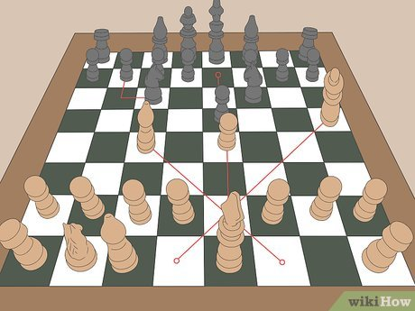

# ♟ Chess Data Analysis Mini Project



## 📖 Project Overview

This project explores a dataset of chess games from [Kaggle](https://www.kaggle.com/datasnaek/chess) to uncover interesting patterns in professional and amateur matches. The analysis focuses on:

- Outcomes of games (White wins, Black wins, Draws)  
- Game length distribution  
- Popular openings and their frequencies  

The goal is **reproducible analysis**: anyone can clone this repo, run the notebook, and reproduce the results.

---

## 🗂 Folder Structure
```plaintext
Mini_Project/
├── games.csv # Original dataset of chess games
├── analysis.ipynb # Jupyter notebook for analysis
├── output/ # Generated plots and visuals
├── requirements.txt # Project dependencies
└── README.md # This file
```
## 🧰 Requirements

- Python 3.x  
- Libraries: `pandas`, `matplotlib`, `seaborn`, `numpy`  
- Jupyter Notebook environment

Install dependencies with:

```bash
pip install pandas matplotlib seaborn numpy
```

## 📚 References

- [Datasnaek / Chess Dataset on Kaggle](https://www.kaggle.com/datasets/datasnaek/chess)  
- [Seaborn: Statistical Data Visualization](https://seaborn.pydata.org/)  
- [Matplotlib: Visualization with Python](https://matplotlib.org/)  
- Nielsen, M. A., & Friedberg, R. M. (2015). *Chess Openings: Theory and Practice*. Dover Publications.  

## How to Reproduce

1. Clone this repository:

```bash
git clone https://github.com/hdzmarcela/Mini-Project.git
cd Mini-Project


---

Marcela Hernández, 2025